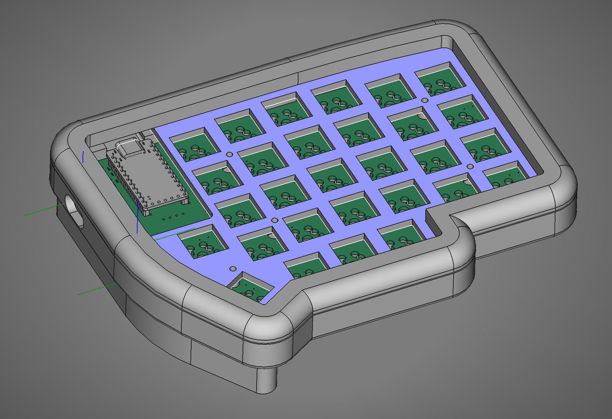

# Lily58 gasket mount case

This is my first custom board and I wanted to create my own gasket mounted case for the lily

This is a fully parametric design (albeit with some slightly ropey parameter names). I have worked to remove instances of topological naming issues with freecad by basing the design of a single reference body, the top plate.

## Features
- Paremetric design
- Gasket mounted top plate
- parametric tenting (only supports pitch at the moment).
- usb-c connector instead of TRRS for safer hotswap.

## References and components 

### Lily58 Pro
https://github.com/kata0510/Lily58

### Bastard splinky - controller
https://github.com/Bastardkb/Splinky
This is a elite-c compatible controller that uses a rpi2040 controller. I had these assembled by JLC PCB

### USB-c connector breakout
https://www.amazon.co.uk/dp/B0C9LCNZRM?psc=1&ref=ppx_yo2ov_dt_b_product_details

### Fasteners
Check the spreadsheet for the case for parameter value

At the moment: 6 x M3x25mm

### CAD tools
Freecad: 0.22.1
https://www.freecad.org/downloads.php
